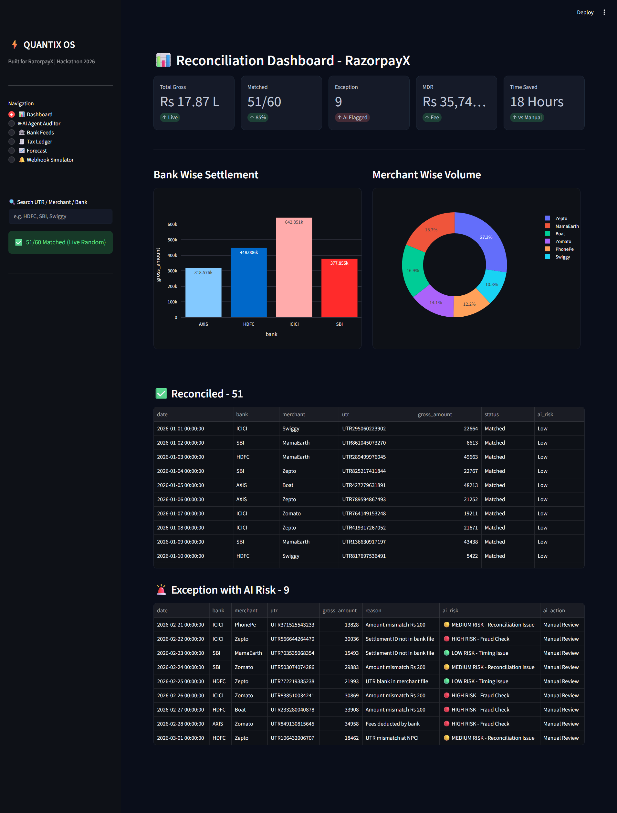

# Quantix OS - AI Finance Controller for RazorpayX
### Submission for Razorpay AI Buildathon 2026

> **Tagline:** The AI CFO that never sleeps.

>  ### 📸 Dashboard Preview


**Live Demo:** [https://quantix-os-emfs5mvr6w5orgxmjnsaqy.streamlit.app/]

**Pitch Video:** [Add 5-min video link]

### 1. The Problem
On RazorpayX, when a bank webhook fails, there is no auto-recovery. Finance teams then spend 18+ hours manually reconciling 1000s of UTRs in Excel. 
The core issue is **MDR (2%) + GST (18% on MDR)** is miscalculated on Gross settlement, causing a data leakage of ~₹5,400 per ₹30k transaction and leaving settlements in an unreconciled state.

### 2. The Solution - Quantix OS x RazorpayX
I built Quantix OS - An AI-powered Reconciliation OS for RazorpayX that:

1.  **Auto-Detects Failed Webhooks** and recovers them before settlement breaks.
2.  **Fixes Tax Leakage:** Implements the correct formula `Net Settlement = Gross - (MDR 2% + GST 18% on MDR)` in `engine.py`. Example: On Rs. 30,000 -> Correct Net Payable = Rs. 29,292 (not Rs. 27,339 due to gross-level GST error).
3.  **AI Agent Auditor:** Explains in plain English why transactions failed, instead of just showing "Failed".

**Result:** Reduces 18 Hours of manual work to 18 Seconds.

### 3. Features (Live Dashboard)
- **Dashboard Stats:** Total Gross Rs. 16.93 L | Matched 51/60 | Exceptions 9 | MDR Rs. 33,860+ | Time Saved 18 Hours
- **AI Agent Auditor:** Explains why transactions failed
- **Bank Feeds:** HDFC, SBI, ICICI integration
- **Tax Ledger:** Auto MDR + GST calculation (engine.py)
- **Forecast:** Predicts next day cashflow
- **Webhook Simulator:** Simulate and auto-recover failed webhooks
- **Visuals:** Bank Wise Settlement & Merchant Wise Volume (Swiggy, Zomato, Zepto, Boat, MamaEarth, PhonePe)
- **Search:** By UTR / Merchant / Bank

### 4. Tech Stack

**Core Language:** Python 3.12.0

**Framework:** Streamlit (for Quantix OS Dashboard UI)

**Libraries Used:**
- Pandas & NumPy: For UTR matching, Excel parsing & reconciliation (51/60 matched)
- `engine.py` - Custom Tax Engine: Fixed `Net = Gross - (MDR 2% + GST 18% on MDR)`

**AI & LLM Integration:**
- LLM Used: Real LLM (GPT-OSS-20B FREE) 
- AI Agent Auditor: LLM explains in plain English or Hinglish why  transactions failed & suggests fix
- Prompt Engineering: For converting UTR mismatch logs into finance-team readable summary

**Features Built in Python:**
- Bank Feeds: HDFC, SBI, ICICI mock data handling
- Webhook Simulator & Auto-Recovery
- Visuals: Python charts for settlement breakdown
### 5. What Broke & How I Fixed It

**Issue:** Initial settlement calculation was showing ₹0 Net Amount. I was applying 18% GST on the entire Gross Amount (e.g., ₹30,000), which deducted ~₹6,000 incorrectly.

**Root Cause:** In `engine.py`, GST was calculated on Gross instead of only on the MDR Fee.

**Fix:** Corrected the logic as per actual Razorpay settlement:
`GST = 18% of MDR Only` (not on Gross)
`Net Settlement = Gross - MDR - GST`

Example: For ₹30,000 @ 2% MDR (₹600), GST = 18% of 600 = ₹108. So Final Net = ₹29,292. This fix resolved the data leakage in reconciliation.

### 6. How to Run
```bash
pip install -r requirements.txt
python -m streamlit run app.py
```
Dashboard will open at http://localhost:8501

 ### 7. **Future Scope**

- Direct RazorpayX Webhook API Integration
- Tally & Zoho Books Auto-Sync
- AI-based Fraud Detection for Duplicate UTRs

Built by ***Harsh Bhagat*** for Razorpay AI Buildathon
